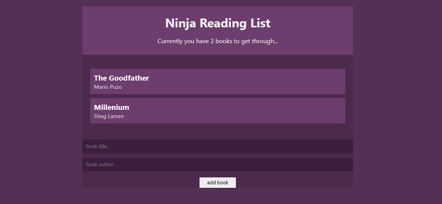

# Ninja Reading List in React

Ninja Reading List is a create react app. It was created for desktop views. It is possible to
add new books and remove books which are already displayed. Program also add books to localstorage

## Tools & Technology used

- Visual Studio Code
- React
- HTML
- CSS
- UUID
- Hooks (useState, useEffect, useReducer, ContextAPI)
